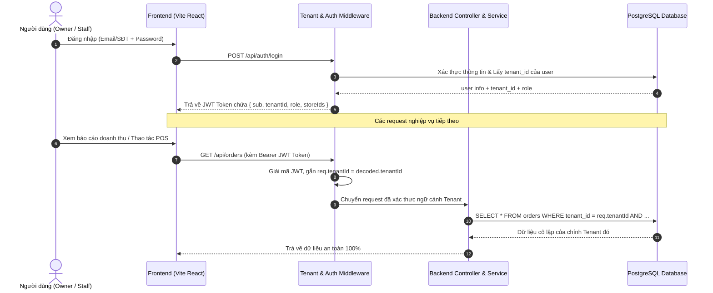

# KIẾN TRÚC ĐA THUÊ BAO (MULTI-TENANT ARCHITECTURE)
**Dự án**: Cafe Management Platform (Multi-Tenant SaaS Web POS)  
**Ngày cập nhật**: 08/09/2026  
**Phiên bản**: v2.0 (Architecture Blueprint)

---

## I. MÔ HÌNH PHÂN TÁCH DỮ LIỆU (DATA TENANCY MODEL)

Hệ thống lựa chọn mô hình **Row-Level Multi-Tenancy (Shared Database, Shared Schema)**:
* **Lý do lựa chọn**:
  1. Tối ưu chi phí hạ tầng và tài nguyên kết nối Database (Supabase pooler).
  2. Dễ dàng bảo trì, chạy migration cập nhật phiên bản phần mềm cho toàn bộ các Tenant cùng một lúc.
  3. Phù hợp nhất cho sản phẩm SaaS hướng tới doanh nghiệp F&B vừa và nhỏ (SMB) tương tự KiotViet, Sapo, Ocha.
* **Nguyên tắc cốt lõi**:
  * Tạo thêm bảng `tenants` để đại diện cho một thương hiệu / tổ chức kinh doanh.
  * Bổ sung cột `tenant_id INTEGER NOT NULL REFERENCES tenants(id)` vào tất cả các bảng dữ liệu nghiệp vụ:
    * `stores` (Các chi nhánh thuộc tenant)
    * `users` (Chủ quán, quản lý, nhân viên, khách hàng thuộc tenant)
    * `products`, `product_categories`, `product_variants` (Menu & Danh mục)
    * `orders`, `order_items` (Hóa đơn bán hàng)
    * `inventory_items`, `inventory_receipts`, `inventory_batches` (Kho hàng)
    * `recipes`, `recipe_items` (Công thức định lượng BOM)
    * `promotions`, `vouchers`, `combo_rules` (Khuyến mãi)
    * `schedules`, `timecards`, `payroll` (Nhân sự & Lương)
    * `customer_tickets` (Khiếu nại)

---

## II. CƠ CHẾ TRUYỀN NGỮ CẢNH THUÊ BAO (TENANT CONTEXT RESOLUTION)



### Các lớp bảo vệ an toàn dữ liệu:
1. **Lớp 1 - JWT Payload**: Token mã hóa chứa sẵn `tenantId` đã được ký bởi Server Secret.
2. **Lớp 2 - Tenant Extraction Middleware**: Tự động gán `req.tenantId = req.user.tenantId`. Nếu request cố tình truyền `tenant_id` khác trong URL/Body mà không khớp với token, hệ thống lập tức từ chối (`403 Forbidden`).
3. **Lớp 3 - Repository Query Parameter**: Mọi câu lệnh SQL đều truyền tham số `$tenantId` làm điều kiện `WHERE tenant_id = $tenantId`.

---

## III. QUY TRÌNH ĐĂNG KÝ & KHỞI TẠO QUÁN MỚI (OWNER ONBOARDING FLOW)

```
[Khách truy cập] ──> Bấm "Đăng ký mở quán" tại Trang chủ
        │
        ▼
[Màn hình Đăng ký] ──> Nhập Họ tên, Email, Mật khẩu, Số điện thoại, Tên thương hiệu
        │
        ▼
[Transaction Khởi tạo Backend]:
  1. Tạo bản ghi `tenants` (name, code, slug, plan_tier = 'trial', status = 'active')
  2. Tạo bản ghi `users` (full_name, email, password_hash, role = 'owner', tenant_id)
  3. Tự động tạo Chi nhánh đầu tiên `stores` (name = "Trụ sở chính", tenant_id)
  4. Gán quyền `owner` quản lý Store #1
  5. (Tùy chọn) Tự động sinh dữ liệu mẫu (Danh mục mẫu: Cà phê, Trà; Đơn vị mẫu: Ly, Chai, g)
        │
        ▼
[Sinh Token & Đăng nhập] ──> Tự động đăng nhập và đưa Owner vào Dashboard cài đặt ban đầu
```

---

## IV. NGUYÊN TẮC QUẢN LÝ THỰC ĐƠN & KHO THEO TENANT

### 1. Phạm vi Thực đơn (Menu Scope)
* Thực đơn được quản lý tập trung ở cấp **Tenant**.
* Tất cả các chi nhánh (Store) thuộc cùng một Tenant mặc định chia sẻ chung danh mục món và công thức pha chế.
* Mỗi Store có thể linh hoạt:
  * Đóng/mở món cụ thể (ví dụ: Store B tạm hết đá xay thì tắt riêng món đá xay).
  * (Nâng cao) Cấu hình mức giá riêng theo mặt bằng chi nhánh nếu được Owner cho phép.

### 2. Phạm vi Kho hàng (Inventory Scope)
* Danh mục nguyên vật liệu dùng chung toàn Tenant (để chuẩn hóa mã và đơn vị tính).
* **Số lượng tồn kho được quản lý riêng biệt theo từng Store**:
  * Store A có kho của Store A (10 kg cà phê, 20 hộp sữa).
  * Store B có kho của Store B (15 kg cà phê, 30 hộp sữa).
* Khi bán hàng tại Store A: Trừ đúng nguyên vật liệu trong kho Store A.
* Hỗ trợ phiếu **Điều chuyển kho (Stock Transfer)** giữa các Store trong cùng 1 Tenant.

### 3. Phạm vi Khách hàng & Hội viên (Customer Scope)
* **Khách hàng Per-Tenant**:
  * Mỗi Tenant sở hữu một tệp khách hàng riêng biệt.
  * Điểm tích lũy, thẻ tem, ví voucher của khách hàng tại "Quán Cà Phê A" chỉ có giá trị sử dụng tại các chi nhánh thuộc "Quán Cà Phê A", không thể dùng chéo sang "Quán Cà Phê B".
