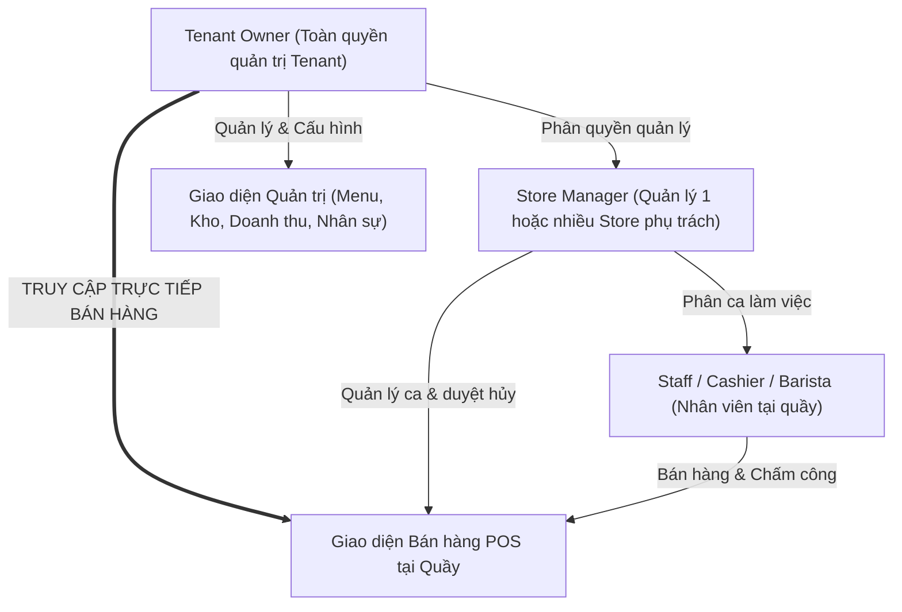

# YÊU CẦU NGHIỆP VỤ: TÁI CẤU TRÚC PHÂN QUYỀN & KIẾN TRÚC MULTI-TENANT
**Mã yêu cầu**: `REQ-01`  
**Tiêu đề**: Restructuring Roles (Owner-Centric) and Multi-Tenant Architecture  
**Trạng thái**: `Approved`  
**Ngày lập**: 08/09/2026  
**Tham chiếu kiến trúc**: [ROLES_AND_PERMISSIONS.md](../ROLES_AND_PERMISSIONS.md), [MULTI_TENANT_ARCHITECTURE.md](../MULTI_TENANT_ARCHITECTURE.md)

---

## 1. BỐI CẢNH & MỤC TIÊU (CONTEXT & OBJECTIVES)
* **Vấn đề**: Hệ thống hiện tại bị chia cắt thành 4 Portal độc lập và 10 Role hành chính cứng nhắc. Chủ quán (Owner) không có một tài khoản hợp nhất để vừa quản lý doanh thu, menu, kho, vừa trực tiếp vào POS bán hàng. Hệ thống cũng chỉ hỗ trợ duy nhất 1 thương hiệu (Single-tenant).
* **Mục tiêu**:
  1. Hợp nhất quyền hạn về tài khoản **Tenant Owner**: Toàn quyền quản trị đa chi nhánh và truy cập trực tiếp màn hình POS bán hàng.
  2. Tinh gọn bộ máy nhân sự nội bộ thành 3 vai trò chính: `Tenant Owner` ➔ `Store Manager` ➔ `Staff`.
  3. Đặt nền móng kiến trúc Multi-Tenant (Row-Level Tenancy với `tenant_id`) để cho phép nhiều thương hiệu cùng hoạt động độc lập trên hệ thống.

---

## 2. USER STORIES

### US-1: Bán hàng linh hoạt cho Chủ quán (Owner POS Access)
* *Là một* **Tenant Owner**,
* *Tôi muốn* có thể chọn bất kỳ chi nhánh nào thuộc chuỗi của mình và truy cập thẳng vào giao diện bán hàng POS,
* *Để* tôi có thể trực tiếp đứng quầy bán hàng, nhận tiền VietQR, mở/đóng ca mà không cần tạo tài khoản nhân viên riêng hoặc đăng xuất khỏi trang quản trị.

### US-2: Quản lý tập trung trong một giao diện (Unified Back-office)
* *Là một* **Tenant Owner**,
* *Tôi muốn* có một thanh Menu Quản trị duy nhất gom toàn bộ tính năng: Doanh thu, Thực đơn, Kho nguyên liệu, Nhân sự các chi nhánh,
* *Để* tôi không phải chuyển đổi qua lại giữa các portal `OFFICE`, `STORE`, `MARKETING`.

### US-3: Phân quyền ủy quyền cho Quản lý chi nhánh (Store Manager Delegation)
* *Là một* **Tenant Owner**,
* *Tôi muốn* phân công tài khoản `Store Manager` phụ trách một chi nhánh cụ thể,
* *Để* Quản lý đó có thể tự xếp lịch nhân viên, nhận hàng từ nhà cung cấp, duyệt kiểm kê ca và xử lý khiếu nại tại chi nhánh đó.

### US-4: Nhân viên làm việc đúng phận sự tại Quầy (Staff Operations)
* *Là một* **Staff (Thu ngân / Barista)**,
* *Tôi muốn* đăng nhập vào ca làm việc để nhận order tại POS, xem màn hình KDS, chấm công và kiểm kê số lượng tồn kho cuối ca,
* *Nhưng tôi không được phép* tự ý xóa hóa đơn đã in, hoàn tiền hoặc xem báo cáo tài chính toàn chuỗi nếu không có sự phê duyệt.

### US-5: Cô lập dữ liệu giữa các Thương hiệu (Data Isolation)
* *Là một* **Tenant Owner**,
* *Tôi muốn* toàn bộ dữ liệu đơn hàng, doanh thu, công thức và nhân sự của quán tôi hoàn toàn bảo mật,
* *Để* các chủ quán khác trên cùng nền tảng SaaS tuyệt đối không thể nhìn thấy dữ liệu của tôi.

---

## 3. SƠ ĐỒ VAI TRÒ & MA TRẬN PHÂN QUYỀN TÍNH NĂNG (FEATURE & ROLE MATRIX)

### 3.1. Sơ đồ Phân cấp & Luồng truy cập của Owner:


### 3.2. Bảng Ma trận Phân quyền Tính năng Chi tiết:
```
+-----------------------------------------------+-------+-------+-------+-------+----------+
| NHÓM TÍNH NĂNG / NGHIỆP VỤ                    | ADMIN | OWNER | S.MGR | STAFF | CUSTOMER |
+-----------------------------------------------+-------+-------+-------+-------+----------+
| 1. BÁN HÀNG & MÀN HÌNH QUẦY (POS & KDS)       |       |       |       |       |          |
| - Truy cập màn hình POS bán hàng              |  [X]  |  [V]  |  [~]  |  [~]  |   [X]    |
| - Tạo đơn, chọn biến thể, topping, áp combo   |  [X]  |  [V]  |  [V]  |  [V]  |   [X]    |
| - Thu tiền mặt / Xuất mã VietQR động          |  [X]  |  [V]  |  [V]  |  [V]  |   [X]    |
| - Giữ đơn (Hold order) & Thanh toán đơn giữ   |  [X]  |  [V]  |  [V]  |  [V]  |   [X]    |
| - Hoàn tiền (Refund) & Hủy hóa đơn (Void)     |  [X]  |  [V]  |  [V]  |  [~]  |   [X]    |
| - Tiếp nhận & Xác nhận đơn online đặt trước   |  [X]  |  [V]  |  [V]  |  [V]  |   [X]    |
| - Mở / Đóng ca, đếm tiền két đối soát chênh   |  [X]  |  [V]  |  [V]  |  [V]  |   [X]    |
| - Màn hình Bếp (KDS) cập nhật tiến độ món     |  [X]  |  [V]  |  [V]  |  [V]  |   [X]    |
| - Màn hình TV gọi số công cộng (Pickup Board) |  [X]  |  [V]  |  [V]  |  [M]  |   [M]    |
+-----------------------------------------------+-------+-------+-------+-------+----------+
| 2. THỰC ĐƠN, CÔNG THỨC & KHUYẾN MÃI           |       |       |       |       |          |
| - Quản lý danh mục, món, size, topping, giá   |  [X]  |  [V]  |  [~]  |  [X]  |   [M]    |
| - Công thức & Định lượng (BOM / Recipe)       |  [X]  |  [V]  |  [M]  |  [X]  |   [X]    |
| - Bán thành phẩm (syrup, sốt, cốt trà pha sẵn)|  [X]  |  [V]  |  [M]  |  [X]  |   [X]    |
| - Tự động trừ kho theo công thức khi POS bán  |  [A]  |  [A]  |  [A]  |  [A]  |   [X]    |
| - Cấu hình Quy tắc Combo giảm giá tự động     |  [X]  |  [V]  |  [X]  |  [X]  |   [M]    |
| - Tạo chiến dịch Voucher, Khuyến mãi          |  [X]  |  [V]  |  [X]  |  [X]  |   [M]    |
+-----------------------------------------------+-------+-------+-------+-------+----------+
| 3. QUẢN LÝ KHO & NGUYÊN VẬT LIỆU              |       |       |       |       |          |
| - Danh mục nguyên vật liệu & đơn vị quy đổi   |  [X]  |  [V]  |  [M]  |  [X]  |   [X]    |
| - Tạo & Duyệt phiếu Nhập kho từ nhà cung cấp  |  [X]  |  [V]  |  [V]  |  [~]  |   [X]    |
| - Kiểm kê kho định kỳ / chốt số đếm thực tế   |  [X]  |  [V]  |  [V]  |  [~]  |   [X]    |
| - Báo cáo hư hao & Tạo Lệnh hủy kho           |  [X]  |  [V]  |  [V]  |  [~]  |   [X]    |
| - Cảnh báo nguyên vật liệu sắp hết tồn kho    |  [X]  |  [V]  |  [V]  |  [V]  |   [X]    |
| - Điều chuyển nguyên liệu giữa các chi nhánh  |  [X]  |  [V]  |  [~]  |  [X]  |   [X]    |
+-----------------------------------------------+-------+-------+-------+-------+----------+
| 4. NHÂN SỰ, XẾP CA & TÍNH LƯƠNG               |       |       |       |       |          |
| - Quản lý hồ sơ nhân viên, hợp đồng, CCCD     |  [X]  |  [V]  |  [M]  |  [~]  |   [X]    |
| - Xếp lịch làm việc theo ca (tuần/tháng)      |  [X]  |  [V]  |  [V]  |  [M]  |   [X]    |
| - Chấm công vào/ra ca (Check-in/Check-out)    |  [X]  |  [V]  |  [V]  |  [V]  |   [X]    |
| - Phê duyệt đổi ca, xin nghỉ phép             |  [X]  |  [V]  |  [V]  |  [~]  |   [X]    |
| - Xem & Chốt bảng lương nhân viên             |  [X]  |  [V]  |  [M]  |  [M]  |   [X]    |
+-----------------------------------------------+-------+-------+-------+-------+----------+
| 5. BÁO CÁO & PHÂN TÍCH DOANH THU              |       |       |       |       |          |
| - Dashboard tổng hợp toàn chuỗi đa Store      |  [X]  |  [V]  |  [X]  |  [X]  |   [X]    |
| - Báo cáo doanh thu chi tiết từng Store       |  [X]  |  [V]  |  [V]  |  [~]  |   [X]    |
| - Báo cáo Giá vốn & Lợi nhuận (COGS / Margin) |  [X]  |  [V]  |  [X]  |  [X]  |   [X]    |
| - Nhật ký thao tác thu ngân (Action Log)      |  [X]  |  [V]  |  [V]  |  [X]  |   [X]    |
+-----------------------------------------------+-------+-------+-------+-------+----------+
| 6. KHÁCH HÀNG & DỊCH VỤ ONLINE                |       |       |       |       |          |
| - Đặt món online (Pick-up), trả VietQR        |  [X]  |  [X]  |  [X]  |  [X]  |   [V]    |
| - Tích điểm hội viên, đổi quà, thẻ tích tem   |  [X]  |  [V]  |  [M]  |  [M]  |   [V]    |
| - CMS đăng tin tức, bài viết, banner ưu đãi   |  [X]  |  [V]  |  [X]  |  [X]  |   [M]    |
| - Chatbot AI tư vấn menu, gợi ý món kèm       |  [X]  |  [V]  |  [X]  |  [X]  |   [V]    |
| - Gửi & Giải quyết khiếu nại đơn hàng         |  [X]  |  [V]  |  [V]  |  [M]  |   [V]    |
+-----------------------------------------------+-------+-------+-------+-------+----------+
| 7. NỀN TẢNG SAAS & QUẢN TRỊ TENANT            |       |       |       |       |          |
| - Đăng ký tài khoản mở quán (Tạo Tenant)      |  [X]  |  [V]  |  [X]  |  [X]  |   [X]    |
| - Quản lý danh sách Tenant, khóa/mở quán      |  [V]  |  [X]  |  [X]  |  [X]  |   [X]    |
| - Quản lý gói cước dịch vụ & gia hạn SaaS     |  [V]  |  [V]  |  [X]  |  [X]  |   [X]    |
+-----------------------------------------------+-------+-------+-------+-------+----------+
Ghi chú: [V]: Toàn quyền | [~]: Giới hạn theo Store phân công | [M]: Chỉ xem | [A]: Hệ thống tự động | [X]: Không có quyền
```

---

## 4. PHẠM VI (SCOPE)

### In-Scope:
* Tái cấu trúc logic middleware phân quyền (`roleGuard`, `portalGuard`) hỗ trợ 4 vai trò nội bộ: `platform_admin`, `owner`, `store_manager`, `staff`.
* Mở quyền truy cập route POS (`/pos/*`) cho role `owner`.
* Thêm nút chuyển đổi chế độ **[Trang Quản trị] <--> [Bán hàng POS]** trên thanh Header.
* Thiết kế bảng `tenants` và bổ sung cột `tenant_id` vào các bảng dữ liệu chính.
* Middleware trích xuất và kiểm tra `tenant_id` từ Token JWT.

### Out-of-Scope (Các đợt sau):
* Cổng thanh toán tự động trả phí thuê bao SaaS định kỳ cho Platform Admin (Billing gateway) - xử lý ở giai đoạn sau.
* Tích hợp máy in nhiệt phần cứng qua Bluetooth/LAN (hiện tại in qua trình duyệt).

---

## 4. TIÊU CHÍ NGHIỆM THU (ACCEPTANCE CRITERIA - AC)

### AC-1: Quyền truy cập của Owner
- [ ] Tài khoản role `owner` đăng nhập thành công vào hệ thống.
- [ ] Header hiển thị nút "Vào POS Bán Hàng".
- [ ] Khi click, Owner được chọn Store cần bán và chuyển ngay sang giao diện `/pos/order`.
- [ ] Owner có thể thực hiện: tạo đơn, thu tiền VietQR/tiền mặt, giữ đơn, hủy đơn, đóng ca.
- [ ] Tại màn hình POS, Owner có nút quay lại "Trang Quản trị" bất kỳ lúc nào.

### AC-2: Tinh gọn Giao diện Quản trị
- [ ] Giao diện quản trị của Owner gom đầy đủ:
  - Báo cáo doanh thu (kế thừa từ Head Officer).
  - Quản lý thực đơn & combo (kế thừa từ Marketing).
  - Quản lý kho hàng & nhập hàng (kế thừa từ Store/DM).
  - Quản lý nhân viên & chấm công (kế thừa từ HR/SM).

### AC-3: Giới hạn quyền hạn của Staff & Store Manager
- [ ] Tài khoản role `staff` chỉ truy cập được POS của Store được phân công, KDS, chấm công cá nhân, bảng lương cá nhân; bị chặn khi cố truy cập báo cáo chuỗi (`403 Forbidden`).
- [ ] Tài khoản role `store_manager` chỉ truy cập được dữ liệu của Store mình phụ trách.

### AC-4: An toàn Dữ liệu Multi-Tenancy
- [ ] Token JWT chứa thông tin `tenantId`.
- [ ] Các API truy vấn danh sách (menu, đơn hàng, kho, nhân viên) chỉ trả về dữ liệu có `tenant_id` khớp với token của user.
