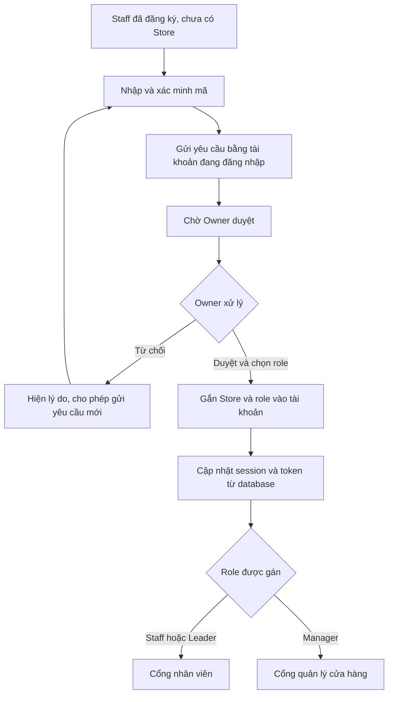

# REQ-15B: Mã mời cửa hàng trên trang Owner và kích hoạt nhân viên sau phê duyệt

**Ngày lập:** 11/09/2026  
**Trạng thái:** Đã triển khai code/database; API đạt, còn chờ nghiệm thu trình duyệt (12/09/2026)  
**Liên quan:** [REQ-15](REQ-15_STAFF_ONBOARDING_ROLE_PORTAL.md), [REQ-04](REQ-04_CONSOLIDATED_HUBS_AND_INVITE_HR.md)  
**Kế hoạch:** [PLAN-15B](../Developing/plans/PLAN-15B_OWNER_STORE_INVITES_AND_STAFF_ACTIVATION.md)

## 1. Vấn đề và mục tiêu

Owner phản ánh chưa thấy mã mời trên trang quản lý, chưa thêm được Staff vào Store và chưa kiểm thử được phân role. REQ-15 được ghi Completed nhưng bằng chứng trước đây chưa đủ chứng minh luồng tài khoản mới chạy xuyên suốt.

Đợt này hoàn thiện một chuỗi nghiệp vụ có thể nghiệm thu:

**Owner chọn chi nhánh và sao chép mã → Staff tự đăng ký, gửi yêu cầu → Owner duyệt và chọn role → tài khoản Staff được kích hoạt đúng chi nhánh → Staff vào đúng portal → Owner thấy nhân viên trong danh sách.**

Phân tích hiện tại dựa trên mã nguồn local và tài liệu. Chưa truy vấn database đang chạy, chưa thực hiện E2E hoặc thay đổi dữ liệu trong phiên lập kế hoạch. Không kết luận chi nhánh cụ thể của Owner đang thiếu mã trong database chỉ từ code.

## 2. User stories

- **US-01 / Owner:** Vào Quản lý nhân sự, chọn cửa hàng, thấy và sao chép được mã mời mà không phải tìm trong bộ chuyển workspace.
- **US-02 / Owner mới:** Cửa hàng đầu tiên có mã mời ngay sau khi đăng ký; chi nhánh cũ chưa có mã có cách cấp mã rõ ràng.
- **US-03 / Staff mới:** Tự đăng ký bằng mật khẩu cá nhân, nhập mã, xác nhận đúng cửa hàng và gửi yêu cầu bằng danh tính đang đăng nhập.
- **US-04 / Staff chờ duyệt:** F5, đăng nhập lại hoặc kiểm tra trạng thái vẫn thấy yêu cầu của mình; chưa được vào nghiệp vụ cửa hàng trước khi được duyệt.
- **US-05 / Owner:** Xem người xin vào, chi nhánh, vị trí mong muốn; chủ động chọn Staff, Trưởng ca hoặc Quản lý khi duyệt.
- **US-06 / Staff được duyệt:** Nhận đúng tenant, store và role mà không tạo thêm tài khoản hoặc đổi mật khẩu; nút Vào làm việc cập nhật phiên thật sự.
- **US-07 / Staff bị từ chối:** Thấy lý do, có thể nhập lại mã và gửi yêu cầu mới; lịch sử cũ vẫn được lưu.
- **US-08 / Owner:** Sau khi duyệt, danh sách nhân sự và số yêu cầu chờ cập nhật đúng; không chỉ hiện thông báo thành công.

## 3. Quy tắc nghiệp vụ đề xuất cho đợt này

### 3.1 Cửa hàng và mã mời

- Mã mời thuộc một Store, Store thuộc một Tenant. Mã chỉ giúp tìm nơi xin gia nhập; biết mã không tự cấp quyền làm việc.
- Điểm vào chính: `/office/hr?tab=requests`, thêm khối **Mời nhân viên vào cửa hàng** ở trên danh sách yêu cầu.
- Quán có một chi nhánh: chọn sẵn. Có nhiều chi nhánh: Owner chọn đúng chi nhánh trước khi sao chép.
- Mã đã tồn tại được giữ nguyên. Chưa có mã: hiển thị **Cấp mã mời**, không giấu cả khối và không sinh mã bằng thao tác đọc dữ liệu.
- Có nút sao chép mã và hướng dẫn đường dẫn đăng ký/nhập mã. Không gửi email, SMS hay tin nhắn tự động trong phạm vi này.
- Chỉ Store đang hoạt động thuộc Tenant hoạt động mới nhận yêu cầu.
- Tạo chi nhánh từ màn hình workspace hiện có phải dùng API quản trị hoạt động và tự sinh mã.
- Đổi/hủy mã, mã dùng một lần, thời hạn mã và lời mời qua email chưa thuộc đợt này.

### 3.2 Danh tính và yêu cầu gia nhập

- Staff phải đăng nhập trước khi xác minh/gửi yêu cầu. `userId` và email được đọc từ danh tính server; không lấy email hoặc userId trong body làm căn cứ xác định người xin vào.
- Luồng mới ưu tiên một tài khoản Staff chưa gán cửa hàng → một cửa hàng làm việc. Không mở rộng thành hệ thống nhiều hợp đồng/nhiều chi nhánh cho một Staff trong đợt này.
- Vị trí mong muốn, ví dụ Thu ngân hoặc Barista, là thông tin ứng tuyển; không tự cấp role, không suy ra quyền quản lý từ nội dung người dùng nhập.
- Mỗi tài khoản có tối đa một yêu cầu pending trong luồng mới. Gửi trùng trả về yêu cầu hiện có; muốn đổi cửa hàng khi pending phải giải quyết yêu cầu trước, UI giải thích rõ.
- Tài khoản đã có nơi làm việc không bị điều chuyển ngầm bằng một lần duyệt khác. Chuyển cửa hàng và làm ở nhiều thương hiệu là nghiệp vụ riêng.
- Yêu cầu bị từ chối giữ nguyên lịch sử; lần gửi lại tạo bản ghi mới.
- Bản ghi yêu cầu phải liên kết `store_join_requests.user_id` với tài khoản thực tế.

### 3.3 Quyền duyệt và phân role

Trong đợt này, **Owner của Tenant là người duyệt và phân role**. Không tự mở quyền phê duyệt cho Manager do một checkbox cũ. Platform Admin chỉ thao tác khi có ngữ cảnh Tenant hợp lệ theo cơ chế quản trị hiện hành, không mặc định chọn Tenant 1.

| Người dùng | Gửi yêu cầu cho chính mình | Xem/chia sẻ mã quản trị | Xem và xử lý yêu cầu toàn Tenant | Nơi vào sau kích hoạt |
|---|---|---|---|---|
| Staff chưa có Store | Có | Không | Không | Trang gia nhập/chờ duyệt |
| Staff | Không gửi thêm trong đợt này | Không | Không | `/store/staff` |
| Shift Leader | Không gửi thêm trong đợt này | Không | Không | `/store/staff`, nhận diện Trưởng ca |
| Store Manager | Không gửi thêm trong đợt này | Không | Không | `/store/manager` |
| Owner | Không dùng luồng ứng tuyển | Có, Store thuộc Tenant mình | Có, Tenant mình | `/office/hr` |

- Role được gán chỉ nằm trong `staff`, `shift_leader`, `store_manager`; API từ chối `owner`, `platform_admin`, role lạ và request đổi Store trái với chi nhánh xin vào.
- Modal mặc định Staff; Owner phải chủ động đổi sang Trưởng ca/Quản lý. Vị trí mong muốn chỉ để tham khảo.
- Ưu tiên ba mẫu role rõ ràng. Chưa hiển thị checkbox như một khả năng phân quyền hoàn chỉnh nếu module đích chưa kiểm soát quyền đó ở backend. Dữ liệu quyền cũ được bảo tồn; không coi việc ghi JSON quyền là bằng chứng mọi nghiệp vụ đã bị giới hạn.
- Duyệt phải cập nhật chính tài khoản Staff đang xin vào và trạng thái request trong cùng transaction; giữ nguyên ID và mật khẩu của tài khoản mới.
- Hai thao tác duyệt/từ chối cạnh tranh chỉ có một kết quả hợp lệ. Không được tạo hai membership hoặc lưu role khác với trạng thái request.

### 3.4 Trạng thái và phiên làm việc

- `unassigned`, `pending`, `approved`, `rejected` là trạng thái onboarding trả về API; chưa cần thêm bốn cột trạng thái vào users nếu có thể suy ra an toàn từ dữ liệu hiện có.
- Trang chờ có nút Kiểm tra trạng thái; tải lại khi quay về tab và thăm dò có giới hạn khi tab đang mở. Lỗi mạng là trạng thái lỗi, không được tự coi là còn pending hoặc đã approved.
- Sau duyệt, thao tác Vào làm việc lấy token mới cùng profile mới. `/auth/me`, refresh, login và workspace switch phải thống nhất role/portal/store/permissions.
- F5 và refresh token không được làm mất trạng thái chờ, email hoặc quyền, cũng không giữ quyền cũ khi server đã thay đổi.
- Session onboarding không truy cập được nghiệp vụ Store/POS/Owner kể cả gọi URL/API trực tiếp. Không fallback tenant/store về 1 cho tài khoản chưa được gán.

## 4. Phạm vi

### Trong phạm vi

- Hiển thị/sao chép/cấp mã còn thiếu ở Owner HR; sửa đường tạo chi nhánh đang gọi API không tồn tại.
- Đồng bộ sinh mã ở hai đường tạo thương hiệu/cửa hàng hiện có.
- Xác thực danh tính người gửi, API xem trạng thái cá nhân, approve/reject đúng Owner và Tenant.
- Sửa cập nhật tài khoản, transaction, chống request trùng và xử lý dữ liệu onboarding cũ có kiểm soát.
- Chuẩn hóa phiên KONEKT, điều hướng, giới hạn Store của Staff/Leader/Manager trong workspace.
- Danh sách nhân sự Owner đọc dữ liệu users/stores mới; phản ánh ngay kết quả duyệt.
- Kiểm thử đủ ba role, từ chối/gửi lại, F5/refresh, request đồng thời, truy cập vượt quyền và khác Tenant/Store.

### Ngoài phạm vi

- Lịch làm việc tuần, GPS chấm công, tính lương (REQ-16 đã nhắc dự kiến REQ-17).
- Hoàn thiện toàn bộ quyền chiết khấu/chốt ca/kho/KDS, sửa VietQR, thay đổi luồng thu ngân.
- Phân quyền tùy ý cho mọi module; xây hệ thống identity/membership nhiều-nhiều mới; điều chuyển nhân sự hoặc sửa role sau tuyển dụng.
- Đổi nhận diện, thiết kế lại toàn bộ Back-office, tạo ảnh/brand kit.

## 5. Tiêu chí nghiệm thu

- [ ] **AC-01:** Owner dùng tài khoản/quán mới thấy cửa hàng và mã mời ở trang HR; chi nhánh cũ thiếu mã có nút cấp và sao chép thành công.
- [ ] **AC-02:** Thêm chi nhánh từ giao diện hiện có thành công, thuộc đúng Tenant, có mã riêng; mã hiện hữu không bị thay đổi.
- [x] **AC-03:** Staff đăng ký và gửi yêu cầu bằng tài khoản thật; request lưu đúng `user_id`, Tenant và Store; email body không thể mạo danh người khác.
- [x] **AC-04:** Mã sai/Store ngừng hoạt động/Tenant ngừng hoạt động bị từ chối rõ ràng; không sinh request rác.
- [ ] **AC-05:** Bấm gửi hai lần hoặc hai tab không sinh hai request pending; F5 và đăng nhập lại vẫn thấy trạng thái đúng.
- [ ] **AC-06:** Owner thấy request đúng Store, duyệt được ba role; role API không hợp lệ bị từ chối, không tự nâng quyền theo vị trí mong muốn.
- [x] **AC-07:** Staff mới giữ nguyên user ID và mật khẩu sau duyệt, không thêm bản ghi users cho cùng lần kích hoạt; user và request cập nhật nguyên tử.
- [ ] **AC-08:** Staff nhận session mới ngay từ trang chờ; Staff/Leader vào cổng nhân viên, Manager vào cổng quản lý; F5/refresh vẫn giữ đúng quyền và Store.
- [ ] **AC-09:** Owner thấy nhân viên vừa duyệt trong danh sách mới, đúng role/Store; badge pending giảm chính xác.
- [ ] **AC-10:** Từ chối hiển thị lý do cho đúng người gửi, cho phép gửi lại; lịch sử xử lý không mất.
- [x] **AC-11:** Staff/Leader/Manager không duyệt được request, không lấy mã quản trị bằng API trực tiếp; Owner A không xem/duyệt request hoặc cấp mã cho Tenant B.
- [x] **AC-12:** Session chưa được gán Store không truy cập nghiệp vụ POS/Store/Owner; Staff/Leader/Manager không chọn chi nhánh khác bằng workspace payload.
- [x] **AC-13:** Duyệt–duyệt hoặc duyệt–từ chối đồng thời cho một kết quả nhất quán; lỗi giữa transaction không để user đã gán nhưng request pending.
- [x] **AC-14:** Báo cáo dữ liệu cũ chỉ ra request chưa liên kết user, duplicate tài khoản và mã thiếu; trường hợp mơ hồ không bị gộp/xóa tự động.
- [ ] **AC-15:** Backend/frontend typecheck và build qua; có biên bản E2E ba role bằng tài khoản mới, ghi rõ dữ liệu, API và màn hình đã kiểm tra.

## 6. Cách đánh giá hoàn thành

Không đánh dấu Completed chỉ vì trang đăng ký hoặc modal role hiển thị đúng. Phải nghiệm thu trọn luồng tài khoản mới, sự thay đổi thực tế trong database, session sau duyệt và các trường hợp bị từ chối quyền. Việc các module HR cũ có nút truy cập không đồng nghĩa đã nghiệm thu chấm công, kho hoặc lương.

## Bằng chứng triển khai (12/09/2026)
[VERIFY-15B](../Developing/logs/VERIFY-15B_STAFF_ONBOARDING.md) ghi audit database trước/sau, migration 0001 đã áp dụng, ba role với tài khoản mới, concurrency và rollback thật. Các AC còn trống đã có code/API tương ứng nhưng chứa điều kiện thao tác giao diện/F5/copy/badge chưa xác nhận bằng browser; không coi build pass là E2E UI pass. Request cũ ID 1 có candidate user IDs 11/12 được giữ nguyên để đối chiếu.
